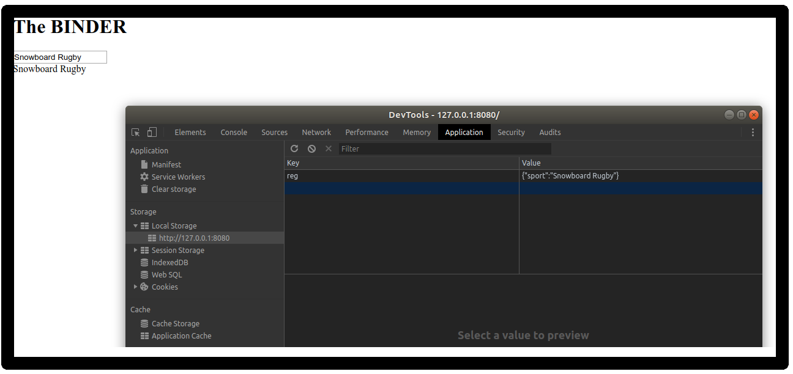

#  The Binder 
A tiny library for binding data on a web page, all in local storage for local people.

It came about when I wanted an app to help keep tally of my son's [five-a-side football scores](//github.com/bangbangsoftware/footswell/).
## Installing / Getting started

### Install...

```shell
npm i https://github.com/bangbangsoftware/binder -D
```

### What can i just copy and paste to get started ???

You can **run** the bash script **./quick-bind.sh**

## Live demo...

This is hosted on github pages [here](http://bangbangsoftware.github.io/binder/example/)

### Basic use...

So add it to your page, most basically like....

```shell
<script type='module' src='./node_modules/binder/dist/go.js'></script>
```

This will register any element on the page with a **name** attribute, eg. 

```shell
<html>
    
    <head><h1> The BINDER </h1></head>
    
    <body>
        <input name='sport' autofocus></input>
        <div name='sport' ></div>
    </body>
    
    <script type='module' src='../node_modules/binder/dist/go.js'></script>
</html>
```

So the above two elements: input and div are binded to the same data named "sport".

This will be stored in localstorage under key "reg". 
The value will be a map, where "sport" is mapped to whatever is typed in 



## Security

Everything is stored locally, so as long as your local storage is safe, so is your data.

## Developing

A pure js application that makes great use of local storage. 

```shell
# Dependencies
None!

# serve with hot reload at [http://127.0.0.1:8080/](http://127.0.0.1:8080/)
npm start

# build for production with minification 
npm run build - yet to do (Might use rollup or snowpack) 

# run unit tests
npm run unit - currently there are none

# run e2e tests
npm run e2e - currently there are none

# run all tests
npm test
```

### Built with
Typescript and jest

### Prerequisites
Nothing, no back end.

### Plugins
Plugins need to be registered with binder through bagItAndTagIt function
it accepts an array of plugins. 

eg.
```shell
import { switchPlugin, togglePlugin, bagItAndTagIt } from "binder";
bagItAndTagIt([togglePlugin, switchPlugin])
```
The plugin should be a function that accepts an object and return a function that accepts a HTML element. 

The object it accepts consists of the binder tools (put, get, putValue, getValue, registerAll, clickListener functions). 
It should filter out any HTML the plugin is not interested in. 

eg.
```shell
 let binder;
 
 export const myPlugin = tools => {
   binder = tools;
   return (element, mode) => {
     const name = element.getAttribute("myPluginAttribute");
     if (!name) {
       return; // this element is not for me.....
     }
     tools.clickListener(element, e => doSomeStuff(element));
   };
};
```
which is run by binder like...
```shell
  plugins.forEach(setup => {
    const plugin = setup(tools);
    plugin(element);
  });
```

### Building, Deploying / Publishing

To build the project...

```shell
npm run build
```
This will build the site to dist, which can be commited and served by github
pages

### Yes, but could it be used for multiple users ???
Well, no - not out the box, not if you wanted to share data across users.
However I was thinking of developing a light weight couchdb like system
using postgres notify, websockets and some simple 
[localStorage](https://en.wikipedia.org/wiki/Web_storage) syncing code...

### More techno bable
It's a *simple fit* to straight forward use case, using localStorage 
as a sort of redux store. It has a plugin system, where you can add 
features in a decoupled way. It is small, in fact these docs are most
likely bigger than the code. So if you want to use routes, just get
the webserver to serve another file, the state will still be there as

## To Do

* [ ] Documentation 
* [X] Swapper 
* [X] Auto generate ids
* [X] Jest
* [x] Put on github pages
* [X] Improve test page
* [X] Typescript
* [X] Event delegation
* [ ] Loop plugin, pass in data and  it will look for that name
* [ ] Mustache syntax plugin, turning it into names

## Versioning

Undecided.

## Configuration

There is zero configuration as of yet apart from setting up the inital team

## FAQ

> How performant is it?

Don't know.

> Is it linked to a browser?

Yes, it binds to the browsers local storage for the domain where it's hosted. Will work on any browser that supports local storage.

## Style guide

Undecided.

## Api Reference

See JSON in local storage

## Licensing

GNU General Public License v3.0
